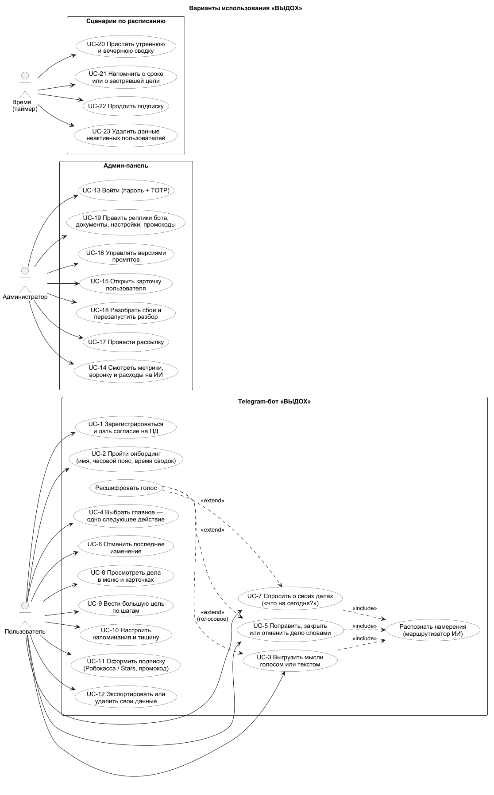
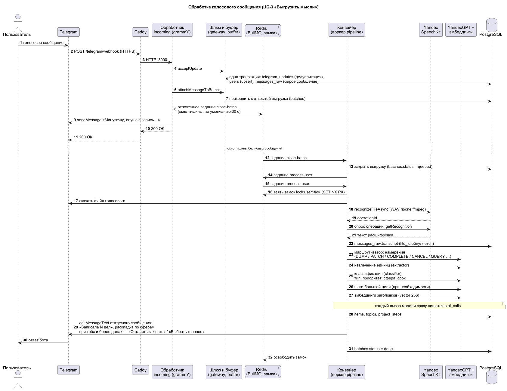
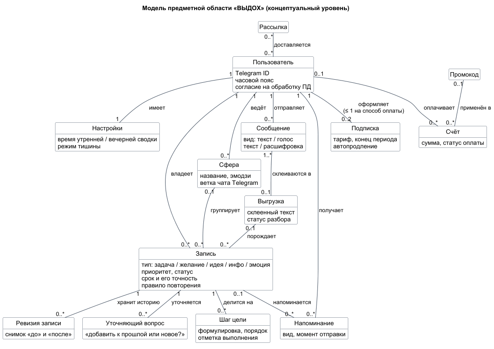
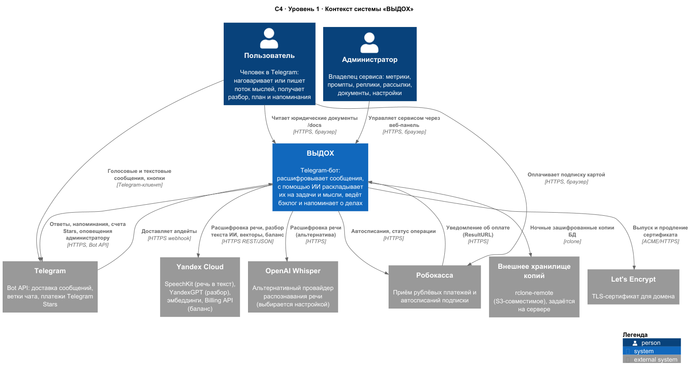
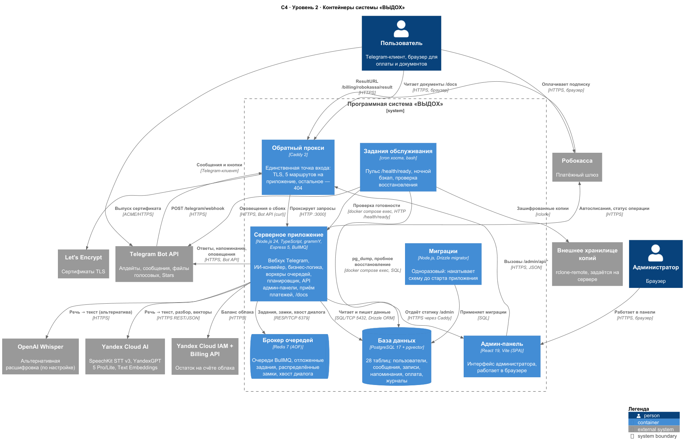
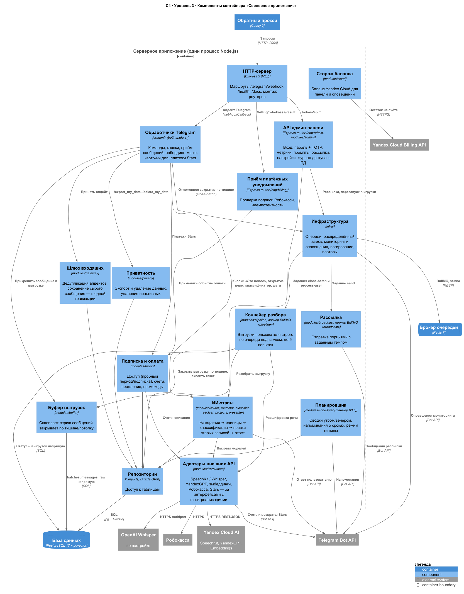
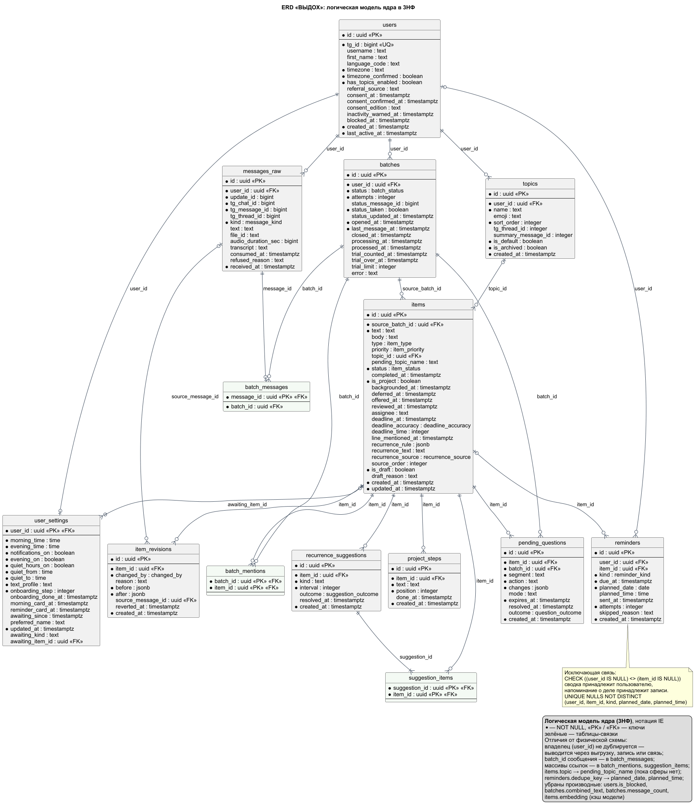
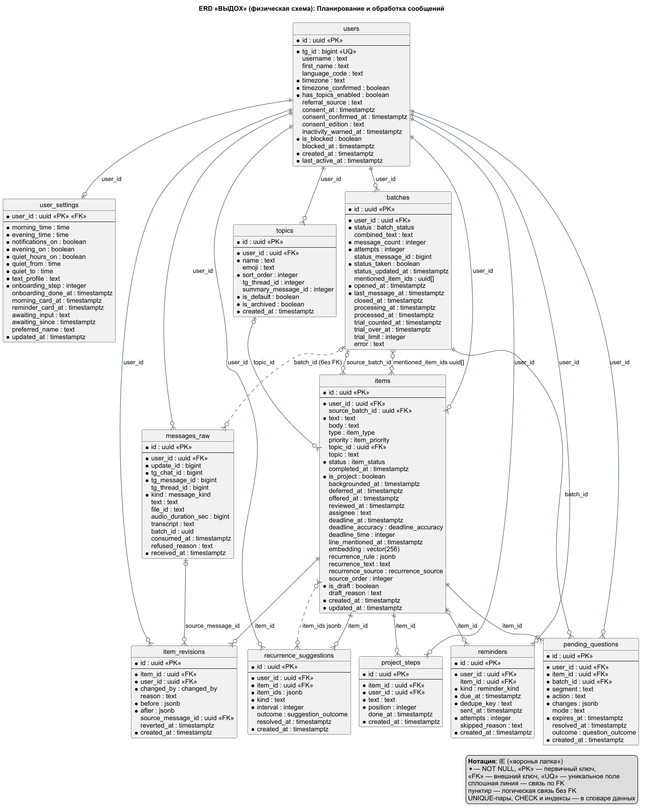
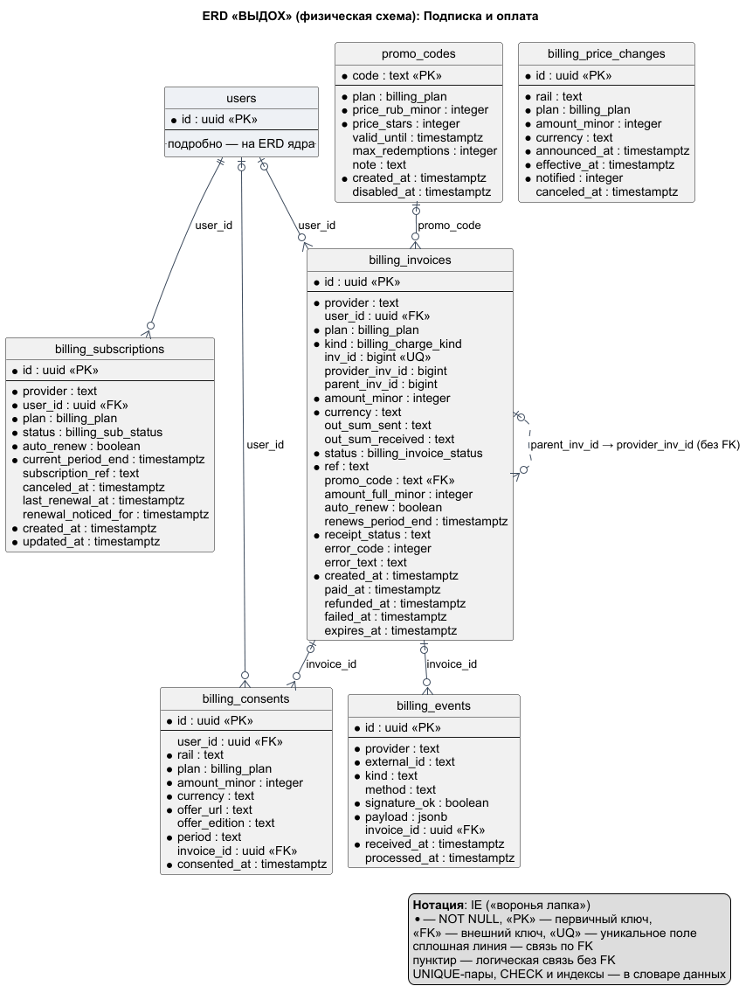
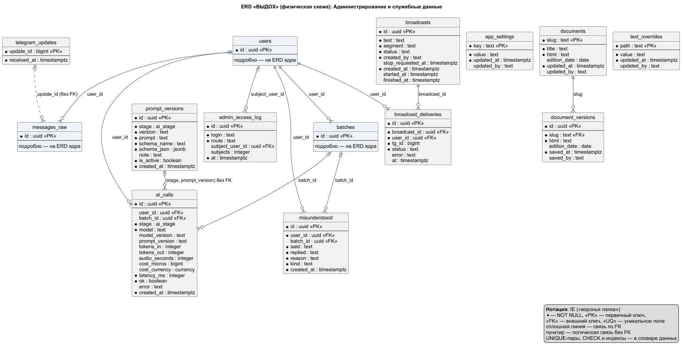

# Архитектура системы «ВЫДОХ»

> **Лабораторная работа №1** по дисциплине «Разработка серверных приложений».
> Тема: проектирование архитектуры серверного приложения и предметной области.
> **Вариант:** собственная тема — сквозной проект ВКР **«Разработка Telegram-бота для планирования задач на основе транскрибации сообщений с использованием ИИ»** (вместо варианта из списка 1–30).
>
> **Лабораторная работа №2:** проектирование REST API и составление спецификации OpenAPI 3.0 для того же проекта.
>
> **Лабораторная работа №3:** создание базового каркаса приложения, Clean / Layered Architecture и настройка окружения.

## Соответствие заданию

| Требование методички | Где выполнено |
|---|---|
| Use Cases минимум для 2 ролей | [2. Роли и сценарии](#2-роли-и-сценарии-использования): 3 роли, 23 сценария, диаграмма, подробный сценарий UC-3 |
| Не менее 5 ключевых сущностей | [3. Модель предметной области](#3-модель-предметной-области) (14 понятий), [5.1](#51-обзор) (28 таблиц) |
| Диаграмма C4 Container (Client, Backend, Database, Redis/Queue) | [4.2. Уровень 2 — Контейнеры](#42-уровень-2--контейнеры-container) |
| ERD в 3НФ: PK (UUID/BIGINT), FK, NOT NULL / UNIQUE / CHECK, индексы | [5.2. ER-диаграммы](#52-er-диаграммы) (логическая модель ядра в 3НФ + физическая схема всех 28 таблиц), [5.5](#55-нормализация-3нф), [5.6](#56-ограничения-целостности-и-индексы) |
| ARCHITECTURE.md: название, описание, роли, Use Cases, C4 картинкой, ERD с описанием полей и связей | этот файл; [описание полей](#53-описание-полей-ключевых-таблиц), [связи](#54-связи), полный [словарь данных](docs/data-dictionary.md) |
| README.md и исходники диаграмм | [README.md](README.md), [`docs/diagrams/*.puml`](docs/diagrams) + PNG/SVG |
| REST API: не менее 6–8 эндпоинтов и таблица доступа | [8. REST API Specs](#8-rest-api-specs-лабораторная-работа-2), 19 операций с аутентификацией и CRUD |
| OpenAPI 3.0: YAML, Request/Response schemas и ErrorResponse | [`openapi.yaml`](openapi.yaml), 12 path-шаблонов и 32 схемы |
| Контрольные вопросы лабораторной №2 | [ответы](docs/lab-02-control-answers.md) |
| Clean / Layered Architecture и структура проекта | [`src`](src): config, controllers, middleware, services, repositories |
| Конфигурация через окружение | [`.env.example`](.env.example), [`src/config/env.ts`](src/config/env.ts), `.env` исключён в [`.gitignore`](.gitignore) |
| Health-check | `GET /api/v1/health` и `GET /health`: `200 OK`, JSON со статусом, именем, версией, окружением и uptime |
| Контрольные вопросы лабораторной №3 | [ответы](docs/lab-03-control-answers.md) |
| Дополнительно | C4 Context и Component, диаграмма последовательности, ключевые архитектурные решения, развёртывание |

## Содержание

1. [О проекте](#1-о-проекте)
2. [Роли и сценарии использования](#2-роли-и-сценарии-использования)
3. [Модель предметной области](#3-модель-предметной-области)
4. [Архитектура по модели C4](#4-архитектура-по-модели-c4)
5. [База данных и ER-диаграмма](#5-база-данных-и-er-диаграмма)
6. [Развёртывание (дополнительно)](#6-развёртывание-дополнительно)
7. [Исходные файлы диаграмм](#7-исходные-файлы-диаграмм)
8. [REST API Specs (лабораторная работа №2)](#8-rest-api-specs-лабораторная-работа-2)
9. [Базовый каркас (лабораторная работа №3)](#9-базовый-каркас-лабораторная-работа-3)

---

## 1. О проекте

### 1.1. Назначение

**«ВЫДОХ»** — Telegram-бот, который помогает не держать всё в голове. Человек наговаривает голосом или пишет поток мыслей как есть, без форм и полей. Бот:

1. расшифровывает голосовые сообщения (Yandex SpeechKit);
2. с помощью языковой модели (YandexGPT) раскладывает сказанное на отдельные **записи** пяти типов — задача, желание, идея, информация, эмоция — и определяет для каждой приоритет, сферу жизни, срок и регулярность;
3. ведёт бэклог дел по сферам (семья, работа, здоровье, дом, покупки, личное);
4. понимает правки словами («хотя нет, в пятницу», «сделала», «больше не надо») и находит, к какой записи они относятся, в том числе по смысловой близости (векторы pgvector);
5. доводит до **одного конкретного следующего действия**: из сказанного предлагает выбрать главное, для большой цели — её ближайший шаг;
6. сам присылает утренние и вечерние сводки и напоминания о сроках с учётом часового пояса и «режима тишины».

Доступ: пробный период, затем подписка (Робокасса или Telegram Stars). Владелец сервиса управляет продуктом через веб-админку.

### 1.2. Технологический стек

| Слой | Технология |
|---|---|
| Язык и среда | TypeScript (strict), Node.js 24 |
| Telegram | grammY (режим webhook), Telegram Bot API, ветки (темы форума) в личных чатах, Telegram Stars |
| HTTP | Express 5 |
| База данных | PostgreSQL 17 + расширение pgvector; Drizzle ORM, миграции drizzle-kit (0000–0069) |
| Очереди и фоновые задачи | Redis 7 + BullMQ: очередь `pipeline` (разбор и отложенное закрытие выгрузки) и `broadcast` (рассылка); распределённый замок на пользователя. Периодические проходы (планировщик, досмотр зависших выгрузок, продления, удаление неактивных) — таймеры внутри процесса |
| ИИ | Yandex SpeechKit STT v3; YandexGPT 5 Pro / Lite (ответы по JSON-схеме); Yandex Text Embeddings (вектор 256). OpenAI Whisper — альтернативный провайдер речи: выбирается настройкой, автоматического переключения нет |
| Оплата | Робокасса, Telegram Stars |
| Админ-панель | React 19 + Vite (SPA) |
| Инфраструктура | Docker Compose, Caddy 2 (HTTPS), cron хоста (бэкапы, проверки) |
| Качество | Vitest (модульные и интеграционные тесты), Playwright, ESLint, Prettier, GitHub Actions CI |

### 1.3. Архитектурный стиль

Система построена как **модульный монолит**: вся серверная логика — один процесс Node.js в одном контейнере. Внутри него работают HTTP-сервер, обработчики Telegram, воркеры очередей BullMQ и планировщик. Код разделён на модули по предметным областям (`modules/pipeline`, `modules/items`, `modules/scheduler`, `modules/billing` …) с явными зависимостями.

Разбор выгрузок (расшифровка и цепочка вызовов ИИ) вынесен в очередь, поэтому вебхук, как правило, не ждёт модель. Исключения — отдельные кнопки («Это новое», «Добавить к прошлой», «Отменить», открытие большой цели без шагов) и ответ словами на «Изменить» в карточке дела: там классификатор, раскладка на шаги или пересчёт вектора вызываются прямо в обработчике. Поэтому срок ответа вебхука в grammY отключён, а повторная доставка апдейта отсекается по `update_id`.

Почему не микросервисы: у сервиса одна команда и одна база; отдельный процесс для воркеров или планировщика потребовал бы второго развёртывания и второй проверки здоровья без выигрыша при текущей нагрузке. Порядок разбора держится на распределённом замке в Redis, идемпотентность приёма и оплаты — на уникальных ключах в БД. Работа нескольких реплик в текущей конфигурации не поддерживается: отправка напоминаний планировщиком не защищена от параллельного процесса.

---

## 2. Роли и сценарии использования

### 2.1. Ролевая модель

| Роль | Кто это | Как взаимодействует |
|---|---|---|
| **Пользователь** | Человек, который пишет боту в личный чат Telegram | Голосовые и текстовые сообщения, кнопки, команды `/start`, `/menu`, `/export_my_data`, `/delete_my_data`, `/terms`, `/paysupport` |
| **Администратор** | Владелец сервиса | Веб-панель `/admin` (вход по паролю и одноразовому коду TOTP); оповещения мониторинга в служебный Telegram-чат |
| **Время (таймер)** | Инициатор сценариев по расписанию | Встроенный планировщик сам запускает сводки, напоминания, продления подписок. Сам планировщик — часть приложения, поэтому актором на диаграмме показано время, а не программный компонент |
| Внешние системы | Telegram, Yandex Cloud, Робокасса | Доставка сообщений, ИИ-сервисы, уведомления об оплате (см. [C4 Context](#41-уровень-1--контекст-system-context)) |

### 2.2. Диаграмма вариантов использования



### 2.3. Сценарии пользователя

| ID | Сценарий | Как вызывается | Результат |
|---|---|---|---|
| UC-1 | Зарегистрироваться и дать согласие на обработку ПД | `/start` (можно с реферальной меткой), экран согласия со ссылками на документы, кнопка «Согласна» | Запись в `users` с моментом и редакцией согласия. Сообщения, присланные до согласия, сохраняются и разбираются после |
| UC-2 | Пройти онбординг | Кнопки или ответ словами: имя → город (часовой пояс) → время утренней и вечерней сводки | Заполнены `users.timezone` и `user_settings` |
| UC-3 | **Выгрузить мысли** голосом или текстом | Одно или серия сообщений; бот отвечает «Слушаю…» (на голосовое — «Минуточку, слушаю запись…») и ждёт окно тишины (по умолчанию 30 с, настраивается в панели); одиночный вопрос разбирается сразу | Записи в `items`, итог «Записала N дел» с раскладкой по сферам ([подробно](#26-подробный-сценарий-uc-3-выгрузить-мысли)) |
| UC-4 | Выбрать главное — одно следующее действие | При трёх и более делах: «Оставить как есть» / «Выбрать главное» → до трёх дел → «Сделать сейчас» | Карточка одного дела; для большой цели — её ближайший шаг |
| UC-5 | Поправить, закрыть или отменить дело словами | Голосом или текстом: «перенеси на пятницу», «сделала», «больше не надо» | Резолвер находит запись и меняет её с ревизией; при сомнении спрашивает «Добавить к прошлой» / «Это новое» (при переносе — «Да, перенести» / «Нет, другое») |
| UC-6 | Отменить последнее изменение | Кнопка «Отменить» под изменением или фраза «отмени последнее» | Откат по последней ревизии (`item_revisions`) |
| UC-7 | Спросить о своих делах | «Что у меня на сегодня?», «что просрочено?» | Ответ по бэклогу; ничего не создаётся |
| UC-8 | Просмотреть дела в меню и карточках | `/menu` → «Мои дела», «Сегодня», «По сферам»; в карточке дела: «Сделано», «Отложить», «Изменить», «Убрать», «В другую сферу»; «Изменить время» и «Все напоминания» — под подтверждением правки, задавшей час дела | Изменение статуса, срока или сферы записи |
| UC-9 | Вести большую цель по шагам | Меню «Большие цели»; ИИ раскладывает цель на шаги; кнопка «Шаг сделан» | Шаги в `project_steps`, наружу — ближайший незакрытый |
| UC-10 | Настроить напоминания | «Настройки»: включить/выключить напоминания, «Не писать ночью», время утра и вечера, город, имя | Обновлены `user_settings` |
| UC-11 | Оформить подписку | «Подписка»: тариф месяц/год, Робокасса или Telegram Stars, согласие на автосписания, промокод, «Отключить продление» | Счёт `billing_invoices`, подписка `billing_subscriptions` |
| UC-12 | Экспортировать или удалить свои данные | `/export_my_data` (JSON-файл), `/delete_my_data` (подтверждение в два шага) | Файл с данными или удаление всех данных человека |

### 2.4. Сценарии администратора

| ID | Сценарий | Раздел панели | Результат |
|---|---|---|---|
| UC-13 | Войти в панель | Экран входа: логин и пароль, затем код TOTP | Сессия в подписанном cookie (HttpOnly, Secure, SameSite=Strict) на 12 ч |
| UC-14 | Смотреть метрики, воронку и расходы на ИИ | «Обзор», «Расходы» | Активные и новые пользователи, выгрузки, воронка «регистрация → первая выгрузка → конец пробного → оплата», расход по этапам и моделям, баланс Yandex Cloud |
| UC-15 | Открыть карточку пользователя | «Пользователи» | Выгрузки с расшифровками, изменения, подписка, расход. Каждое обращение к персональным данным пишется в `admin_access_log` |
| UC-16 | Управлять версиями промптов | «Промпты» | Горячая правка — новая версия в `prompt_versions`; включение — после прогона контрольного набора, без прогона только с явным подтверждением, которое записывается в версию |
| UC-17 | Провести рассылку | «Рассылка» | Черновик, сегмент получателей, предпросмотр, запуск/остановка/повтор; доставки в `broadcast_deliveries` |
| UC-18 | Разобрать сбои и перезапустить разбор | «Ошибки» | Журнал сбойных выгрузок, вызовов моделей, платежей; повторная постановка выгрузки в очередь |
| UC-19 | Править реплики бота, документы, настройки, промокоды | «Реплики», «Документы», «Настройки» | `text_overrides`, `documents` + `document_versions`, `app_settings`, `promo_codes` — без перевыкладки |

### 2.5. Сценарии по расписанию (актор «Время»)

| ID | Сценарий | Когда | Результат |
|---|---|---|---|
| UC-20 | Прислать утреннюю и вечернюю сводку | Проход каждые 60 с, по местному времени пользователя | Дела на сегодня, разбор вчерашнего, итог дня; учитываются режим тишины и снижение частоты, если человек не отвечает |
| UC-21 | Напомнить о сроке или о застрявшей цели | О сроке — накануне, в день срока, за 30 мин (по умолчанию) до названного часа; о цели — после 7 дней без движения, не чаще раза в 5 дней | О сроке — кнопки «Сделано» / «Перенести»; о цели — «Возьмусь» / «Не сейчас» |
| UC-22 | Продлить подписку | Проход раз в час | Предупреждение за 4 суток, автосписание (Робокасса), уведомление о смене цены |
| UC-23 | Удалить данные неактивных | Проход раз в 6 ч | Через 24 месяца тишины — предупреждение, ещё через 30 дней — удаление |

### 2.6. Подробный сценарий UC-3 «Выгрузить мысли»

**Актор:** Пользователь. **Предусловие:** пользователь начал диалог с ботом (есть запись в `users`).

**Основной поток:**

1. Пользователь отправляет голосовое (или несколько сообщений подряд).
2. Telegram доставляет апдейт вебхуком; приложение **в одной транзакции** отмечает `update_id` (защита от повторной доставки), обновляет пользователя и сохраняет сырое сообщение в `messages_raw` — «сначала сохранить, потом думать». Затем проверяются согласие на обработку ПД и доступ (пробный период или подписка).
3. Сообщение прикрепляется к открытой **выгрузке** (`batches`), в очередь ставится отложенное задание закрытия выгрузки, бот отвечает «Минуточку, слушаю запись…» (на текст — «Слушаю…»).
4. Каждое новое сообщение сдвигает срок. После окна тишины (по умолчанию 30 с), 15 сообщений или 5 минут выгрузка закрывается и ставится в очередь разбора.
5. Воркер очереди берёт замок на пользователя и разбирает его выгрузки строго по порядку.
6. Голосовые скачиваются, перекодируются (ffmpeg) и расшифровываются SpeechKit (асинхронно: запрос → опрос операции → результат); ссылка на файл после расшифровки удаляется.
7. Маршрутизатор (YandexGPT) делит текст на намерения: новые мысли, правка, выполнение, отмена, вопрос, болтовня, ответ.
8. Для новых мыслей — выделение отдельных единиц и классификация: тип, приоритет, сфера, срок и его точность, регулярность; для большой цели — шаги.
9. Для записей считаются векторы (эмбеддинги), всё сохраняется в `items`, `topics`, `project_steps`; каждый вызов модели сразу учитывается в `ai_calls`.
10. Бот заменяет статусное сообщение итогом: «Записала N дел», раскладка по сферам, что на сегодня и завтра; при трёх и более делах — кнопки «Оставить как есть» / «Выбрать главное». Выгрузка получает статус `done`.

**Альтернативные потоки:**

- *2a. Нет согласия.* Сообщение сохраняется, бот показывает экран согласия; разбор — после нажатия «Согласна».
- *2b. Нет доступа* (закончился пробный или оплаченный период, не прошло продление). Сообщение сохраняется с причиной (`refused_reason`), бот сообщает об этом и, если оплата открыта, даёт кнопку «Подписка».
- *2c. Превышен суточный лимит выгрузок.* Сообщение сохраняется с причиной `dumpLimit` и в разбор не попадает; бот отвечает, что на сегодня достаточно и новые выгрузки он разберёт завтра, а записанное доступно через `/menu`.
- *7a. В речи правка старого дела.* Резолвер ищет запись (память сессии, векторная близость, совпадение срока) и либо применяет изменение с ревизией, либо задаёт уточняющий вопрос (`pending_questions`).
- *7b. Вопрос о делах.* Ответ по бэклогу, записи не создаются.
- *7c. Кризисные маркеры в тексте.* Разбор останавливается, отправляется заранее подготовленный ответ.
- *10a. Только чувства, без дел.* Короткий ответ без кнопок.
- *6a/7d. Сбой внешнего сервиса.* При временном сбое выгрузка возвращается в очередь — всего до 5 попыток (первая и 4 повтора); после каждого неудачного прохода, который будет повторён, статусное сообщение заменяется текстом о задержке (если статус уже занят ответом — приходит отдельным сообщением). При постоянной ошибке или исчерпании попыток — сообщение о сбое, выгрузка получает статус `failed`, видна администратору в разделе «Ошибки» и может быть перезапущена. Если сбой вызван простоем на нашей стороне (нет доступа к модели, исчерпан бюджет), попытка не расходуется.



---

## 3. Модель предметной области

Концептуальная модель — ключевые понятия и их связи без технических полей. Логическая и физическая модели — в разделе 5.



| Понятие | Таблица | Смысл |
|---|---|---|
| Пользователь | `users` | Человек в Telegram; корень всех его данных |
| Настройки | `user_settings` | Время сводок, режим тишины, состояние онбординга (1:1, создаются вместе с пользователем) |
| Сообщение | `messages_raw` | Сырое входящее сообщение и его расшифровка |
| Выгрузка | `batches` | Серия сообщений, разбираемая как одна мысль |
| **Запись** | `items` | Задача / желание / идея / информация / эмоция с приоритетом, сроком, регулярностью |
| Сфера | `topics` | Сфера жизни, по которой группируются записи (может иметь свою ветку в чате Telegram) |
| Шаг цели | `project_steps` | Упорядоченные шаги большой цели |
| Напоминание | `reminders` | Запланированная сводка или напоминание о сроке |
| Ревизия записи | `item_revisions` | История изменений для отката |
| Уточняющий вопрос | `pending_questions` | Отложенное действие, ожидающее ответа пользователя |
| Подписка | `billing_subscriptions` | Доступ к сервису; не более одной на каждый способ оплаты |
| Счёт, Промокод | `billing_invoices`, `promo_codes` | Оплата и скидка на первый период |
| Рассылка | `broadcasts` + `broadcast_deliveries` | Сообщение администратора группе пользователей (связь N:M) |

---

## 4. Архитектура по модели C4

### 4.1. Уровень 1 — Контекст (System Context)

Система целиком и её окружение: люди и внешние системы.



### 4.2. Уровень 2 — Контейнеры (Container)

Отдельно запускаемые части системы, их технологии и протоколы взаимодействия. Клиенты — Telegram-клиент пользователя и SPA админ-панели; бэкенд — серверное приложение; хранилища — PostgreSQL и Redis (очереди).



| Контейнер | Технология | Ответственность | Взаимодействие |
|---|---|---|---|
| Обратный прокси | `caddy:2-alpine` | Единственная точка входа из интернета: TLS, сжатие, журнал доступа. Пропускает только `/telegram/webhook`, `/admin*`, `/billing/robokassa/result`, `/docs*`, `/robots.txt`, остальное — 404. TLS: на домене — сертификат Let's Encrypt, без домена — самоподписанный сертификат, который передаётся Telegram при регистрации вебхука | Порты 80/443 наружу → `bot:3000` (HTTP внутри docker-сети) |
| Серверное приложение | `node:24-alpine` + ffmpeg; TypeScript, grammY, Express 5, BullMQ, Drizzle ORM | Приём вебхука, сохранение сообщений, ИИ-конвейер, бизнес-логика записей и напоминаний, API админ-панели, приём платёжных уведомлений, публичные документы. В том же процессе: воркеры очередей `pipeline` (параллельность 5) и `broadcast` (1), планировщик (60 с), досмотр зависших выгрузок, продления, мониторинг | PostgreSQL (SQL/TCP 5432), Redis (RESP/TCP 6379), внешние API по HTTPS |
| Админ-панель | React 19 + Vite (SPA) | Интерфейс администратора в браузере. Собирается в том же Docker-образе, статику отдаёт серверное приложение по `/admin` | HTTPS-запросы `/admin/api/*` (JSON, cookie-сессия) |
| База данных | `pgvector/pgvector:pg17` | Хранение всех данных (28 таблиц), поиск похожих записей по векторам. Порт наружу не публикуется | SQL/TCP 5432 только внутри docker-сети |
| Брокер очередей | `redis:7-alpine`, AOF | Очереди BullMQ и отложенные задания (переживают перезапуск), распределённые замки `lock:user:<id>`, память дребезга оповещений, хвост диалога `dialog:<chatId>` (хранится до 12 реплик 30 мин; модели передаётся только при включённой настройке) | RESP/TCP 6379 |
| Миграции | тот же образ, Drizzle migrator | Одноразовый контейнер: накатывает схему БД один раз и до старта приложения, а не при каждом его запуске | SQL |
| Задания обслуживания | cron хоста, bash, `pg_dump`, `gpg`, `rclone` | Пульс `/health/ready` каждые 10 мин, ночной зашифрованный бэкап, ежедневная проверка восстановления, оповещения о сбоях | `docker compose exec` в контейнеры, rclone, Telegram Bot API (curl) |

**Внешние системы:**

| Система | Назначение | Протокол | Направление |
|---|---|---|---|
| Telegram Bot API | Приём апдейтов, ответы, файлы голосовых, ветки чата, платежи Stars, оповещения мониторинга | HTTPS: webhook (вход) + REST JSON (выход) | в обе стороны |
| Yandex SpeechKit STT v3 | Распознавание речи (асинхронно: запрос → опрос операции → результат) | HTTPS REST JSON | приложение → сервис |
| YandexGPT (Foundation Models) | Маршрутизация, извлечение, классификация, резолвер, ответы — со строгой JSON-схемой | HTTPS REST JSON | приложение → сервис |
| Yandex Text Embeddings | Смысловые векторы записей и запросов (256) | HTTPS REST JSON | приложение → сервис |
| Yandex Cloud IAM + Billing API | Остаток на счёте облака для панели и оповещений | HTTPS (JWT → IAM-токен) | приложение → сервис |
| OpenAI Whisper | Альтернативный провайдер распознавания речи (выбирается настройкой сервера вместо SpeechKit) | HTTPS multipart | приложение → сервис |
| Робокасса | Страница оплаты, уведомление ResultURL, автосписания, статус операции | HTTPS | в обе стороны |
| Внешнее хранилище копий | Зашифрованные копии БД вне сервера: rclone-remote из настроек сервера (предполагается S3-совместимое хранилище; если внешнее хранилище не задано, копии остаются на сервере) | rclone | cron хоста → хранилище |
| Let's Encrypt | Выпуск и продление TLS-сертификата (при работе на домене) | ACME | Caddy → сервис |

### 4.3. Уровень 3 — Компоненты серверного приложения (Component, дополнительно)

Уровень Container отвечает на вопрос «из каких запускаемых частей состоит система», а уровень Component — «как устроена одна из них внутри». Ниже — компоненты контейнера «Серверное приложение»: они живут в одном процессе и отдельно не разворачиваются.



Слои внутри приложения:

| Слой | Где в коде | Что делает |
|---|---|---|
| Транспорт | `bot/handlers/*` (grammY), `http/*` (Express) | Принимает апдейты и HTTP-запросы, разбирает кнопки и параметры, вызывает сервисы |
| Бизнес-логика (service layer) | `modules/<область>/*.service.ts` | Правила предметной области: буфер выгрузок, конвейер разбора, резолвер, планировщик, подписка, приватность |
| Доступ к данным | `modules/<область>/*.repo.ts`, `db/schema.ts` | Запросы через Drizzle ORM, транзакции |
| Адаптеры внешних API | `modules/*/providers/*` | SpeechKit / Whisper, YandexGPT, эмбеддинги, Робокасса, Stars — за общими интерфейсами, у каждого есть mock-реализация для тестов |
| Инфраструктура | `infra/*` | Пул соединений, очереди, распределённый замок, повторы с таймаутами, мониторинг, логирование |

Зависимости собираются вручную в корне композиции (`index.ts`) и передаются в модули параметрами, что позволяет подменять внешние сервисы в тестах. Слоистость держится на соглашении: к БД напрямую, минуя репозитории, обращаются часть обработчиков и ряд сервисов (буфер, конвейер, планировщик).

### 4.4. Ключевые архитектурные решения (дополнительно)

| Решение | Зачем |
|---|---|
| Webhook вместо long polling | Telegram сам доставляет апдейты по HTTPS; нет постоянного опроса |
| «Сначала сохранить, потом думать» | Сообщение попадает в БД до расшифровки и ИИ — при любом сбое оно не теряется |
| Очередь BullMQ + замок на пользователя | Разбор выгрузок не держит вебхук; выгрузки одного человека разбираются строго по порядку; повторы при временных сбоях |
| Идемпотентность на уровне БД | Уникальные ключи: `telegram_updates.update_id`, `billing_events (provider, external_id, kind)`, `reminders (user_id, dedupe_key)`, частичные уникальные индексы на продление и промокод — повторная доставка не создаёт дублей |
| Адаптеры провайдеров за интерфейсами | Провайдер речи или модели меняется настройкой; тесты работают без сети |
| Версии промптов в БД | Правка промпта без выкладки, с откатом; каждый вызов модели помечается версией промпта |
| Миграции отдельным контейнером | Схема накатывается один раз до старта приложения |
| Безопасность периметра | Наружу открыт только прокси и пять путей; порт PostgreSQL не публикуется; вход в панель — пароль (scrypt) + TOTP, замедление перебора паролей по IP-адресу; подписанный cookie сессии; журнал доступа к персональным данным |
| Защита персональных данных | Явное согласие с редакцией документа, экспорт и удаление данных по команде, удаление после 24 месяцев неактивности, ссылка на голосовой файл удаляется после расшифровки, запрет логирования запросов на стороне Yandex (`x-data-logging-enabled: false`) |
| Наблюдаемость и восстановление | `/health`, `/health/ready`, внешний пульс, оповещения в Telegram-чат (доля ошибок, недоступность модели, баланс); ночной зашифрованный бэкап с копией во внешнее хранилище и ежедневная проверка восстановления |

---

## 5. База данных и ER-диаграмма

### 5.1. Обзор

- СУБД: **PostgreSQL 17** с расширением **pgvector** (колонка `items.embedding vector(256)`).
- **28 таблиц**, **33 внешних ключа**, 17 перечислимых типов (ENUM), 70 миграций (`0000`–`0069`).
- **Первичные ключи.** Суррогатный `uuid` (`gen_random_uuid()`) у сущностей; у `user_settings` первичный ключ одновременно внешний ключ `user_id`; у журнала апдейтов — `bigint` (`telegram_updates.update_id`, идентификатор Telegram). **Отступление от требования «UUID или BIGINT»:** у четырёх справочников первичный ключ — естественный текстовый (`app_settings.key`, `documents.slug`, `promo_codes.code`, `text_overrides.path`). Эти значения уникальны по природе, стабильны и сами используются как адрес: `/docs/<slug>`, ключ настройки, код, который вводит пользователь, путь реплики в словаре. Суррогатный ключ здесь добавил бы лишний JOIN без выгоды. Если коды когда-нибудь придётся переименовывать, альтернатива такая: `promo_codes (id uuid PRIMARY KEY, code text NOT NULL UNIQUE)` и ссылка `billing_invoices.promo_id uuid REFERENCES promo_codes(id)`.
- **Удаление пользователя.** Данные человека удаляются каскадом (`ON DELETE CASCADE`), в том числе подписки, журнал «непонятого» и доставки рассылок. У `billing_invoices`, `billing_consents`, `ai_calls` и `admin_access_log` ссылка обнуляется (`SET NULL`): записи обезличиваются, но остаются для учёта.

Полное описание всех полей, ограничений и индексов — в **[словаре данных](docs/data-dictionary.md)**. Столбец «Физическая схема»: **3НФ**, **денормализация** (осознанная, с причиной, раздел 5.5) или **нарушение 1НФ** (массив или составное значение).

| № | Таблица | Назначение | Группа | Физическая схема |
|---|---|---|---|---|
| 1 | [`users`](docs/data-dictionary.md#users) | Пользователь бота (человек в Telegram): Telegram-идентификатор, профиль, часовой пояс, согласие на обработку персональных данных, признак блокировки бота. Корень каскадного удаления данных человека. | Планирование и обработка сообщений | денормализация |
| 2 | [`user_settings`](docs/data-dictionary.md#user_settings) | Настройки и диалоговое состояние пользователя (1:1 с users, создаются вместе с пользователем): время утренней и вечерней сводки, режим тишины, шаг онбординга, ожидание ответа словами. | Планирование и обработка сообщений | нарушение 1НФ |
| 3 | [`messages_raw`](docs/data-dictionary.md#messages_raw) | Сырые входящие сообщения (текст, голос, аудио). Сохраняются до расшифровки и до обращения к ИИ, чтобы ничего не потерять; хранят расшифровку и привязку к выгрузке. | Планирование и обработка сообщений | денормализация |
| 4 | [`batches`](docs/data-dictionary.md#batches) | Выгрузка — серия сообщений, склеенная в одну «мысль» (закрывается после окна тишины). Единица обработки ИИ-конвейером: статус обработки, число попыток, учёт пробного периода. | Планирование и обработка сообщений | нарушение 1НФ |
| 5 | [`items`](docs/data-dictionary.md#items) | Запись — результат разбора потока мыслей: задача, желание, идея, информация или эмоция; приоритет, сфера, статус, срок, регулярность, смысловой вектор. Центральная сущность планирования. | Планирование и обработка сообщений | денормализация |
| 6 | [`topics`](docs/data-dictionary.md#topics) | Сферы жизни пользователя (семья, работа, здоровье…): название, эмодзи, порядок, привязка к ветке (теме форума) личного чата Telegram. | Планирование и обработка сообщений | 3НФ |
| 7 | [`item_revisions`](docs/data-dictionary.md#item_revisions) | История изменений записи: кто и почему изменил, полные снимки «до» и «после». Позволяет откатить изменение одной кнопкой. | Планирование и обработка сообщений | денормализация |
| 8 | [`pending_questions`](docs/data-dictionary.md#pending_questions) | Открытый уточняющий вопрос бота («добавить к прошлой записи или это новое?») с отложенным действием. Не более одного открытого вопроса на пользователя. | Планирование и обработка сообщений | денормализация |
| 9 | [`recurrence_suggestions`](docs/data-dictionary.md#recurrence_suggestions) | Предложение бота запомнить регулярность дела: связка похожих записей, найденный ритм и ответ пользователя. | Планирование и обработка сообщений | нарушение 1НФ |
| 10 | [`project_steps`](docs/data-dictionary.md#project_steps) | Шаги большой цели (записи-проекта): упорядоченный список с отметкой выполнения; пользователю показывается ближайший незакрытый шаг. | Планирование и обработка сообщений | денормализация |
| 11 | [`reminders`](docs/data-dictionary.md#reminders) | Запланированные напоминания и сводки: вид, момент отправки, ключ идемпотентности, отметка отправки, причина пропуска. | Планирование и обработка сообщений | денормализация |
| 12 | [`promo_codes`](docs/data-dictionary.md#promo_codes) | Промокоды на первый период подписки: фиксированная цена в рублях и в звёздах Telegram, срок действия, лимит применений. | Подписка и оплата | 3НФ |
| 13 | [`billing_invoices`](docs/data-dictionary.md#billing_invoices) | Счёт — одна строка на каждую попытку оплаты (включая продления) через Робокассу или Telegram Stars. | Подписка и оплата | денормализация |
| 14 | [`billing_subscriptions`](docs/data-dictionary.md#billing_subscriptions) | Подписка пользователя в конкретном платёжном канале: тариф, статус, автопродление, конец оплаченного периода. Не более одной на пользователя и канал. | Подписка и оплата | 3НФ |
| 15 | [`billing_events`](docs/data-dictionary.md#billing_events) | Журнал уведомлений платёжных провайдеров; уникальность (provider, external_id, kind) защищает от повторной обработки платежа. | Подписка и оплата | денормализация |
| 16 | [`billing_price_changes`](docs/data-dictionary.md#billing_price_changes) | История изменения цены для продлений действующих подписок, с датой вступления в силу. | Подписка и оплата | денормализация |
| 17 | [`billing_consents`](docs/data-dictionary.md#billing_consents) | История согласий пользователя на автосписания: что было показано (сумма, тариф, периодичность, редакция оферты) и когда. | Подписка и оплата | денормализация |
| 18 | [`telegram_updates`](docs/data-dictionary.md#telegram_updates) | Журнал обработанных update_id Telegram для идемпотентности: Telegram может прислать один апдейт повторно. Записи старше 24 ч удаляются. | Администрирование и служебные данные | 3НФ |
| 19 | [`prompt_versions`](docs/data-dictionary.md#prompt_versions) | Версии промптов для этапов ИИ-конвейера. На этап — не более одной активной версии (частичный UNIQUE); что активная версия есть, проверяет код. Правятся из админ-панели без выкладки. | Администрирование и служебные данные | 3НФ |
| 20 | [`ai_calls`](docs/data-dictionary.md#ai_calls) | Журнал каждого обращения к моделям ИИ (распознавание речи, YandexGPT, эмбеддинги): этап, модель, токены, стоимость, задержка, успех или ошибка. | Администрирование и служебные данные | денормализация |
| 21 | [`app_settings`](docs/data-dictionary.md#app_settings) | Системные настройки продукта «ключ — значение» (пробный период, лимиты, цены, выключатели функций); правятся из админ-панели. | Администрирование и служебные данные | 3НФ |
| 22 | [`documents`](docs/data-dictionary.md#documents) | Публичные юридические документы (оферта, политика конфиденциальности, соглашение, согласие на обработку ПД) — текущая редакция, отдаётся по адресу `/docs/<slug>`. | Администрирование и служебные данные | денормализация |
| 23 | [`document_versions`](docs/data-dictionary.md#document_versions) | История версий документов: каждое сохранение — отдельная строка (для отката и доказательства действовавшей редакции). | Администрирование и служебные данные | 3НФ |
| 24 | [`text_overrides`](docs/data-dictionary.md#text_overrides) | Реплики бота, изменённые из админ-панели. Хранятся только переопределения: нет строки — действует текст из кода. | Администрирование и служебные данные | 3НФ |
| 25 | [`misunderstood`](docs/data-dictionary.md#misunderstood) | Журнал «непонятого»: что сказал пользователь и что ответил бот, когда не смог разобрать сообщение. | Администрирование и служебные данные | денормализация |
| 26 | [`admin_access_log`](docs/data-dictionary.md#admin_access_log) | Журнал доступа администратора к персональным данным: кто, в какой раздел панели, к чьим данным и когда. | Администрирование и служебные данные | 3НФ |
| 27 | [`broadcasts`](docs/data-dictionary.md#broadcasts) | Рассылка администратора: текст, сегмент получателей, статус, автор, время запуска и окончания. | Администрирование и служебные данные | 3НФ |
| 28 | [`broadcast_deliveries`](docs/data-dictionary.md#broadcast_deliveries) | Доставка рассылки конкретному пользователю — связующая таблица N:M между broadcasts и users с атрибутами доставки. | Администрирование и служебные данные | денормализация |

### 5.2. ER-диаграммы

Нотация — IE («воронья лапка»): `●` — NOT NULL, `<<PK>>` / `<<FK>>` / `<<UQ>>` — ключи; сплошная линия — связь по внешнему ключу, пунктир — логическая связь без FK. Проектирование шло от концептуальной модели (раздел 3) к логической и физической.

**Логическая модель ядра в 3НФ** (11 таблиц ядра, где сосредоточены связи предметной области, и 3 таблицы-связки). Отличия от физической схемы:

- владелец (`user_id`) не дублируется: у записи он выводится через обязательную исходную выгрузку (каждая запись рождается из выгрузки), у ревизий, вопросов, шагов и предложений — через запись;
- принадлежность сообщения к выгрузке вынесена в `batch_messages` (иначе `messages_raw.batch_id → batches.user_id` дублировал бы `messages_raw.user_id`);
- массивы ссылок заменены таблицами-связками `batch_mentions` и `suggestion_items`;
- у напоминания — исключающая связь: сводка принадлежит пользователю, напоминание о деле — записи (`CHECK ((user_id IS NULL) <> (item_id IS NULL))`); строковый ключ `dedupe_key` заменён снимком `planned_date` / `planned_time` и уникальностью `(user_id, item_id, kind, planned_date, planned_time)`;
- вместо `items.topic` — `pending_topic_name`: название сферы от классификатора хранится, только пока такой сферы нет (после создания сферы — ссылка `topic_id`);
- составное значение `awaiting_input` разделено на вид ожидания и ссылку на запись; убраны производные поля (`users.is_blocked`, `batches.combined_text`, `batches.message_count`, кэш `items.embedding`).

Для групп «оплата» и «служебные» логическая модель совпадает с физической схемой за вычетом полей, перечисленных в разделе 5.5.



**Физическая схема** — фактические таблицы PostgreSQL, три диаграммы по предметным группам. Осознанные отступления от логической модели перечислены в разделе 5.5. `users` показан сокращённо на второй и третьей диаграммах, `batches` и `messages_raw` — на третьей.

*Ядро: планирование и обработка сообщений*



*Подписка и оплата*



*Администрирование и служебные данные*



> Логическая ERD в этом разделе специально показывает модель ядра в 3НФ. Физические ERD ниже отражают фактическую схему закрытого приложения и поэтому содержат описанные в разделе 5.5 осознанные денормализации. В частности, исключающая связь `user_id`/`item_id` для `reminders` относится к логической модели; в физической таблице `reminders.user_id` обязателен, а дублирование владельца и ключ идемпотентности описаны в словаре данных.

### 5.3. Описание полей ключевых таблиц

Шесть центральных таблиц; остальные 22 — в [словаре данных](docs/data-dictionary.md).

#### `users`

Пользователь бота (человек в Telegram): Telegram-идентификатор, профиль, часовой пояс, согласие на обработку персональных данных, признак блокировки бота. Корень каскадного удаления данных человека.

| Поле | Тип | Ограничения | Описание |
|---|---|---|---|
| `id` | `uuid` | PK, DEFAULT `gen_random_uuid()` | суррогатный ключ пользователя |
| `tg_id` | `bigint` | NOT NULL, UNIQUE | ID пользователя в Telegram (bigint, читается как число) |
| `username` | `text` |  | username Telegram, обновляется при каждом сообщении |
| `first_name` | `text` |  | имя из Telegram, обновляется при каждом сообщении |
| `language_code` | `text` |  | язык клиента Telegram |
| `timezone` | `text` | NOT NULL, DEFAULT `'Europe/Moscow'` | часовой пояс пользователя (имя IANA, например Europe/Moscow) |
| `timezone_confirmed` | `boolean` | NOT NULL, DEFAULT `false` | пояс подтверждён на онбординге |
| `has_topics_enabled` | `boolean` | NOT NULL, DEFAULT `false` | включён ли в чате режим веток (тем форума Telegram) |
| `referral_source` | `text` |  | параметр реферальной ссылки, пишется только при первом запуске |
| `consent_at` | `timestamptz` |  | момент первого согласия: у ранних пользователей — первое сообщение после публикации политики, у остальных — нажатие «Согласна» |
| `consent_confirmed_at` | `timestamptz` |  | нажатие «Согласна» — единственное согласие на разбор |
| `consent_edition` | `text` |  | редакция политики/согласия, на которую нажато |
| `inactivity_warned_at` | `timestamptz` |  | отправлено предупреждение об удалении после 24 месяцев тишины |
| `is_blocked` | `boolean` | NOT NULL, DEFAULT `false` | пользователь заблокировал бота |
| `blocked_at` | `timestamptz` |  | начало текущего периода блокировки бота |
| `created_at` | `timestamptz` | NOT NULL, DEFAULT `now()` | момент регистрации |
| `last_active_at` | `timestamptz` | NOT NULL, DEFAULT `now()` | последняя активность пользователя |

Уникальность: `users_tg_id_unique` — UNIQUE (tg_id).

Индексы: `users_active_last_seen_idx` — btree (last_active_at) WHERE is_blocked = false.

#### `messages_raw`

Сырые входящие сообщения (текст, голос, аудио). Сохраняются до расшифровки и до обращения к ИИ, чтобы ничего не потерять; хранят расшифровку и привязку к выгрузке.

| Поле | Тип | Ограничения | Описание |
|---|---|---|---|
| `id` | `uuid` | PK, DEFAULT `gen_random_uuid()` | суррогатный ключ сообщения |
| `user_id` | `uuid` | FK → users.id, NOT NULL | автор сообщения |
| `update_id` | `bigint` | NOT NULL | update_id Telegram (логическая ссылка, без FK) |
| `tg_chat_id` | `bigint` | NOT NULL | ID чата Telegram |
| `tg_message_id` | `bigint` | NOT NULL | ID сообщения в чате Telegram |
| `tg_thread_id` | `bigint` |  | ветка (тема форума) личного чата, если есть |
| `kind` | `message_kind` | NOT NULL | вид сообщения: text/voice/audio/other |
| `text` | `text` |  | текст сообщения |
| `file_id` | `text` |  | file_id голосового или аудио в Telegram; обнуляется сразу после расшифровки (файл не хранится) |
| `audio_duration_sec` | `bigint` |  | длительность аудио в секундах |
| `transcript` | `text` |  | расшифровка голосового (модуль speech) |
| `batch_id` | `uuid` |  | выгрузка, в которую попало сообщение (без FK-ограничения) |
| `consumed_at` | `timestamptz` |  | сообщение использовано как ответ на вопрос бота и в разбор не идёт |
| `refused_reason` | `text` |  | почему сообщение не принято в разбор: trial / expired / renewalFailed / dumpLimit |
| `received_at` | `timestamptz` | NOT NULL, DEFAULT `now()` | момент приёма сообщения |

Уникальность: `messages_raw_chat_message_uq` — UNIQUE btree (tg_chat_id, tg_message_id).

Индексы: `messages_raw_user_received_idx` — btree (user_id, received_at); `messages_raw_batch_idx` — btree (batch_id).

#### `batches`

Выгрузка — серия сообщений, склеенная в одну «мысль» (закрывается после окна тишины). Единица обработки ИИ-конвейером: статус обработки, число попыток, учёт пробного периода.

| Поле | Тип | Ограничения | Описание |
|---|---|---|---|
| `id` | `uuid` | PK, DEFAULT `gen_random_uuid()` | суррогатный ключ выгрузки |
| `user_id` | `uuid` | FK → users.id, NOT NULL | владелец выгрузки |
| `status` | `batch_status` | NOT NULL, DEFAULT `'open'` | статус: open/queued/processing/awaiting_answer/done/failed |
| `combined_text` | `text` |  | склейка расшифровок и текстов в порядке получения |
| `message_count` | `integer` | NOT NULL, DEFAULT `0` | счётчик сообщений для потолка в 15 |
| `attempts` | `integer` | NOT NULL, DEFAULT `0` | сколько раз обработка срывалась |
| `status_message_id` | `bigint` |  | ID единственного статусного сообщения в Telegram |
| `status_taken` | `boolean` | NOT NULL, DEFAULT `false` | статусное сообщение занято ответом по существу |
| `status_updated_at` | `timestamptz` |  | когда статусное сообщение правилось |
| `mentioned_item_ids` | `uuid[]` |  | записи, упомянутые в выгрузке (массив без FK) |
| `opened_at` | `timestamptz` | NOT NULL, DEFAULT `now()` | момент открытия выгрузки |
| `last_message_at` | `timestamptz` | NOT NULL, DEFAULT `now()` | последнее сообщение, от него окно тишины |
| `closed_at` | `timestamptz` |  | момент закрытия выгрузки |
| `processing_at` | `timestamptz` |  | когда взяли в разбор (порог «застряла») |
| `processed_at` | `timestamptz` |  | когда разбор завершён |
| `trial_counted_at` | `timestamptz` |  | выгрузка потратила пробный период |
| `trial_over_at` | `timestamptz` |  | этой выгрузкой пробный период исчерпан (одна на человека) |
| `trial_limit` | `integer` |  | снимок предела пробного периода в тот момент |
| `error` | `text` |  | текст ошибки обработки |

Уникальность: `batches_one_open_per_user_uq` — UNIQUE btree (user_id) WHERE status = 'open'; `batches_trial_over_once_idx` — UNIQUE btree (user_id) WHERE trial_over_at IS NOT NULL.

CHECK: `batches_trial_over_pair` — `CHECK ((trial_over_at IS NULL) = (trial_limit IS NULL))`.

Индексы: `batches_status_opened_idx` — btree (status, opened_at); `batches_user_opened_idx` — btree (user_id, opened_at); `batches_trial_idx` — btree (user_id) WHERE trial_counted_at IS NOT NULL; `batches_trial_over_idx` — btree (trial_over_at) WHERE trial_over_at IS NOT NULL.

#### `items`

Запись — результат разбора потока мыслей: задача, желание, идея, информация или эмоция; приоритет, сфера, статус, срок, регулярность, смысловой вектор. Центральная сущность планирования.

| Поле | Тип | Ограничения | Описание |
|---|---|---|---|
| `id` | `uuid` | PK, DEFAULT `gen_random_uuid()` | суррогатный ключ записи |
| `user_id` | `uuid` | FK → users.id, NOT NULL | владелец записи |
| `source_batch_id` | `uuid` | FK → batches.id | выгрузка, из которой родилась запись |
| `text` | `text` | NOT NULL | заголовок дела/мысли |
| `body` | `text` |  | подробности, добавленные к делу позже |
| `type` | `item_type` |  | тип: TASK / DESIRE / IDEA / INFO / EMOTION; у черновика пусто |
| `priority` | `item_priority` |  | приоритет: NOW / SOON / LATER / NONE |
| `topic_id` | `uuid` | FK → topics.id | сфера записи (ссылка, источник истины) |
| `topic` | `text` |  | название сферы — кэш для показа без JOIN |
| `status` | `item_status` | NOT NULL, DEFAULT `'new'` | статус жизненного цикла записи |
| `completed_at` | `timestamptz` |  | когда дело закрыли/выполнили последний раз |
| `is_project` | `boolean` | NOT NULL, DEFAULT `false` | задача является большой целью с шагами |
| `backgrounded_at` | `timestamptz` |  | ушла в фон («начать с чистого листа») |
| `deferred_at` | `timestamptz` |  | ушла в «Позже»: срок снят |
| `offered_at` | `timestamptz` |  | когда последний раз предлагали утром из отложенного |
| `reviewed_at` | `timestamptz` |  | когда показана в разборе вчерашнего |
| `assignee` | `text` |  | кому можно передать дело (заметка) |
| `deadline_at` | `timestamptz` |  | срок записи |
| `deadline_accuracy` | `deadline_accuracy` |  | точность срока: day/week/month |
| `deadline_time` | `integer` |  | час срока — минуты от местной полуночи 0..1439 |
| `line_mentioned_at` | `timestamptz` |  | когда живая строка ответа упоминала запись |
| `embedding` | `vector(256)` |  | смысловой вектор текста (Yandex text-search-doc) |
| `recurrence_rule` | `jsonb` |  | правило повторения {kind, interval, anchor, days?} |
| `recurrence_text` | `text` |  | фраза человека о повторе: «каждый вторник» |
| `recurrence_source` | `recurrence_source` |  | откуда регулярность: stated/asked/noticed/history |
| `source_order` | `integer` |  | порядок записи внутри своей выгрузки |
| `is_draft` | `boolean` | NOT NULL, DEFAULT `false` | черновик: разобрать не удалось |
| `draft_reason` | `text` |  | ошибка и сырой ответ модели для черновика |
| `created_at` | `timestamptz` | NOT NULL, DEFAULT `now()` | момент создания записи |
| `updated_at` | `timestamptz` | NOT NULL, DEFAULT `now()` | момент последнего изменения |

CHECK: `items_draft_or_classified` — `CHECK ((is_draft = true) OR (type IS NOT NULL AND priority IS NOT NULL AND topic IS NOT NULL))`; `items_recurrence_task_only` — `CHECK (recurrence_rule IS NULL OR type = 'TASK')`; `items_recurrence_has_source` — `CHECK ((recurrence_rule IS NULL AND recurrence_text IS NULL) OR recurrence_source IS NOT NULL)`; `items_deadline_with_accuracy` — `CHECK ((deadline_at IS NULL) = (deadline_accuracy IS NULL))`; `items_deadline_time_day_only` — `CHECK (deadline_time IS NULL OR (deadline_accuracy IS NOT NULL AND deadline_accuracy = 'day' AND deadline_time BETWEEN 0 AND 1439))`.

Индексы: `items_user_status_priority_idx` — btree (user_id, status, priority); `items_user_deadline_idx` — btree (user_id, deadline_at); `items_source_batch_idx` — btree (source_batch_id); `items_drafts_idx` — btree (created_at) WHERE is_draft = true; `items_user_active_idx` — btree (user_id) WHERE backgrounded_at IS NULL.

#### `topics`

Сферы жизни пользователя (семья, работа, здоровье…): название, эмодзи, порядок, привязка к ветке (теме форума) личного чата Telegram.

| Поле | Тип | Ограничения | Описание |
|---|---|---|---|
| `id` | `uuid` | PK, DEFAULT `gen_random_uuid()` | суррогатный ключ сферы |
| `user_id` | `uuid` | FK → users.id, NOT NULL | владелец сферы |
| `name` | `text` | NOT NULL | название сферы, уникально у пользователя |
| `emoji` | `text` |  | эмодзи-маркер сферы |
| `sort_order` | `integer` | NOT NULL, DEFAULT `0` | порядок показа сфер |
| `tg_thread_id` | `integer` |  | ветка (тема форума) личного чата Telegram для сферы |
| `summary_message_id` | `integer` |  | ID сообщения-сводки сферы в её ветке |
| `is_default` | `boolean` | NOT NULL, DEFAULT `false` | сфера по умолчанию для нераспознанного |
| `is_archived` | `boolean` | NOT NULL, DEFAULT `false` | сфера в архиве |
| `created_at` | `timestamptz` | NOT NULL, DEFAULT `now()` | момент создания сферы |

Уникальность: `topics_user_name_uq` — UNIQUE btree (user_id, name); `topics_user_thread_uq` — UNIQUE btree (user_id, tg_thread_id) WHERE tg_thread_id IS NOT NULL.

Индексы: `topics_user_sort_idx` — btree (user_id, sort_order).

#### `reminders`

Запланированные напоминания и сводки: вид, момент отправки, ключ идемпотентности, отметка отправки, причина пропуска.

| Поле | Тип | Ограничения | Описание |
|---|---|---|---|
| `id` | `uuid` | PK, DEFAULT `gen_random_uuid()` | суррогатный ключ напоминания (uuid, генерируется БД) |
| `user_id` | `uuid` | FK → users.id, NOT NULL | кому напоминание |
| `item_id` | `uuid` | FK → items.id | запись; пусто у утренних и вечерних |
| `kind` | `reminder_kind` | NOT NULL | вид напоминания |
| `due_at` | `timestamptz` | NOT NULL | момент отправки в UTC |
| `dedupe_key` | `text` | NOT NULL | ключ идемпотентности: вид[:id записи]:местная дата[:ЧЧ:ММ], например morning:2026-08-30 |
| `sent_at` | `timestamptz` |  | момент отправки; пусто — не отправлено |
| `attempts` | `integer` | NOT NULL, DEFAULT `0` | сколько раз отправка сорвалась |
| `skipped_reason` | `text` |  | код причины, по которой напоминание не отправлено |
| `created_at` | `timestamptz` | NOT NULL, DEFAULT `now()` | момент раскладки |

Уникальность: `reminders_user_key_uq` — UNIQUE btree (user_id, dedupe_key).

Индексы: `reminders_pending_idx` — btree (due_at); `reminders_user_kind_idx` — btree (user_id, kind).


### 5.4. Связи

Типы связей в схеме:

- **1:1** — `users` ↔ `user_settings` (первичный ключ настроек одновременно внешний ключ на пользователя; настройки создаются вместе с пользователем);
- **1:N** — все остальные внешние ключи (пользователь → записи, запись → шаги, счёт → события оплаты …);
- **N:M** — `broadcasts` ↔ `users` через связующую таблицу `broadcast_deliveries` (уникальная пара `(broadcast_id, user_id)` + атрибуты доставки: статус, ошибка, время). В логической модели так же устроены `batch_mentions` и `suggestion_items`; `batch_messages` — связь 1:N, вынесенная в отдельную таблицу (сообщение входит не более чем в одну выгрузку);
- **логические связи без FK** (пунктир на физических ERD): `messages_raw.batch_id` → `batches`; `messages_raw.update_id` → `telegram_updates` (журнал апдейтов чистится через 24 ч); `(ai_calls.stage, ai_calls.prompt_version)` → `prompt_versions (stage, version)`; `(billing_invoices.provider, parent_inv_id)` → `(provider, provider_inv_id)` (материнский платёж для продлений; уникальность пары ограничением не обеспечена); массивы `batches.mentioned_item_ids` и `recurrence_suggestions.item_ids` → `items`.

Все внешние ключи:

| Родитель | Потомок (FK) | Тип связи | Обязательность | ON DELETE |
|---|---|---|---|---|
| `users` | `user_settings.user_id` | 1:1 | обязательная (NOT NULL) | CASCADE |
| `users` | `messages_raw.user_id` | 1:N | обязательная (NOT NULL) | CASCADE |
| `users` | `batches.user_id` | 1:N | обязательная (NOT NULL) | CASCADE |
| `users` | `items.user_id` | 1:N | обязательная (NOT NULL) | CASCADE |
| `batches` | `items.source_batch_id` | 1:N | необязательная (NULL) | SET NULL |
| `topics` | `items.topic_id` | 1:N | необязательная (NULL) | SET NULL |
| `users` | `topics.user_id` | 1:N | обязательная (NOT NULL) | CASCADE |
| `items` | `item_revisions.item_id` | 1:N | обязательная (NOT NULL) | CASCADE |
| `users` | `item_revisions.user_id` | 1:N | обязательная (NOT NULL) | CASCADE |
| `messages_raw` | `item_revisions.source_message_id` | 1:N | необязательная (NULL) | SET NULL |
| `users` | `pending_questions.user_id` | 1:N | обязательная (NOT NULL) | CASCADE |
| `items` | `pending_questions.item_id` | 1:N | обязательная (NOT NULL) | CASCADE |
| `batches` | `pending_questions.batch_id` | 1:N | обязательная (NOT NULL) | CASCADE |
| `users` | `recurrence_suggestions.user_id` | 1:N | обязательная (NOT NULL) | CASCADE |
| `items` | `recurrence_suggestions.item_id` | 1:N | обязательная (NOT NULL) | CASCADE |
| `items` | `project_steps.item_id` | 1:N | обязательная (NOT NULL) | CASCADE |
| `users` | `project_steps.user_id` | 1:N | обязательная (NOT NULL) | CASCADE |
| `users` | `reminders.user_id` | 1:N | обязательная (NOT NULL) | CASCADE |
| `items` | `reminders.item_id` | 1:N | необязательная (NULL) | CASCADE |
| `users` | `billing_invoices.user_id` | 1:N | необязательная (NULL) | SET NULL |
| `promo_codes` | `billing_invoices.promo_code` | 1:N | необязательная (NULL) | SET NULL |
| `users` | `billing_subscriptions.user_id` | 1:N | обязательная (NOT NULL) | CASCADE |
| `billing_invoices` | `billing_events.invoice_id` | 1:N | необязательная (NULL) | SET NULL |
| `users` | `billing_consents.user_id` | 1:N | необязательная (NULL) | SET NULL |
| `billing_invoices` | `billing_consents.invoice_id` | 1:N | необязательная (NULL) | SET NULL |
| `users` | `ai_calls.user_id` | 1:N | необязательная (NULL) | SET NULL |
| `batches` | `ai_calls.batch_id` | 1:N | необязательная (NULL) | SET NULL |
| `documents` | `document_versions.slug` | 1:N | обязательная (NOT NULL) | CASCADE |
| `users` | `misunderstood.user_id` | 1:N | обязательная (NOT NULL) | CASCADE |
| `batches` | `misunderstood.batch_id` | 1:N | необязательная (NULL) | SET NULL |
| `users` | `admin_access_log.subject_user_id` | 1:N | необязательная (NULL) | SET NULL |
| `broadcasts` | `broadcast_deliveries.broadcast_id` | 1:N | обязательная (NOT NULL) | CASCADE |
| `users` | `broadcast_deliveries.user_id` | 1:N | обязательная (NOT NULL) | CASCADE |

### 5.5. Нормализация (3НФ)

Определения (через функциональную зависимость `A → B`: каждому значению A соответствует ровно одно значение B):

- **1НФ** — значения атомарны, нет повторяющихся групп. Списки вынесены в отдельные таблицы: шаги цели — `project_steps`, история документа — `document_versions`, в логической модели ядра — упомянутые записи и связки записей (`batch_mentions`, `suggestion_items`). Колонки `jsonb` хранят документы, которые читаются и пишутся целиком (снимки ревизий, тело уведомления об оплате, JSON-схема промпта, правило повторения): для БД это одно значение.
- **2НФ** — 1НФ и каждый неключевой атрибут зависит от **всего** потенциального ключа, а не от его части. В физической схеме у всех таблиц простой первичный ключ; у таблиц-связок логической модели ключ составной, но неключевых атрибутов нет, поэтому 2НФ выполняется тривиально. Составные уникальные ключи (`topics (user_id, name)`, `billing_subscriptions (user_id, provider)`, `project_steps (item_id, position)` …) проверены на частичные зависимости; найденные в физической схеме перечислены в таблице ниже.
- **3НФ** — 2НФ и нет **транзитивных** зависимостей неключевого атрибута от ключа через другой неключевой атрибут. Устранены выносом сущностей: сферы — таблица `topics`, запись хранит только ссылку (иначе было бы `item → (user_id, название сферы) → эмодзи, порядок`); промокоды — `promo_codes`, счёт хранит только код (иначе `invoice → promo_code → план, цены, срок`). Отдельно от нормализации: `user_settings` — вертикальное разбиение `users` 1:1, `app_settings` — самостоятельная сущность.

**Снимки на момент события нарушением не являются.** Значение, зафиксированное в момент события, — исторический факт, а не функциональная зависимость от текущего значения другой таблицы: суммы в `billing_invoices` и `billing_consents` (цены меняются), `ai_calls.cost_micros` (прайс меняется), `batches.trial_limit` (настройка пробного периода меняется), `item_revisions.before/after`, `prompt_versions.schema_json` (схема на момент создания версии; при загрузке сверяется с кодом). Поэтому они есть и в логической модели.

Логическая модель ядра ([диаграмма в 5.2](#52-er-диаграммы)) находится в 3НФ. На физическом уровне сохранены **осознанные отступления** — каждое с причиной и способом поддержания согласованности:

| Вид | Где | Зачем | Согласованность |
|---|---|---|---|
| Дублирование владельца `user_id` | `items`, `messages_raw`, `item_revisions`, `project_steps`, `pending_questions`, `recurrence_suggestions`; у `reminders`, `misunderstood`, `ai_calls` — только при заполненной ссылке на запись или выгрузку (иначе `user_id` — единственная связь) | Выборки по пользователю без JOIN; удаление и экспорт данных человека по прямой связи; частичный уникальный индекс «один открытый вопрос на человека» невозможно выразить через JOIN | Код записывает `user_id` владельца родителя; БД равенство не проверяет (строго — составной FK `(item_id, user_id) → items(id, user_id)` при `UNIQUE (id, user_id)` на `items`) |
| Частичный кэш значения из другой таблицы | `items.topic` — название сферы от классификатора: при заполненном `topic_id` совпадает с `topics.name`, при пустом — самостоятельное значение (такой сферы ещё нет) | Список дел и выборки «По сферам» идут по тексту без JOIN; `CHECK` разобранной записи опирается на `topic` | Меняется в одной транзакции с `topic_id`; проверяется интеграционным тестом |
| Транзитивная зависимость ради самодостаточной записи | `currency` у `billing_invoices`, `billing_price_changes`, `billing_consents` (определяется платёжным каналом); `billing_consents.period` (определяется тарифом) | Финансовая и юридическая запись должна читаться сама по себе | Значение вычисляет код при записи |
| Частичная зависимость от потенциального ключа | `project_steps.user_id` (от `item_id`); `broadcast_deliveries.tg_id` (от `user_id`, совпадает с `users.tg_id`); `reminders.kind` и `item_id` (закодированы в `dedupe_key`); `billing_events.invoice_id` (от `(provider, external_id)`: у Stars события оплаты и возврата одного платежа имеют один `external_id`) | Проверка владельца по кнопке; адрес фактической доставки; ключ идемпотентности со снимком даты срока в поясе пользователя (сверяется при отправке); журнал уведомлений как есть | `UNIQUE` на ключах идемпотентности; остальное — код |
| Производное значение | `batches.combined_text`, `batches.message_count`, `users.is_blocked`, `items.embedding`, `documents` (текущая редакция = последняя строка `document_versions`) | Снимок входа разбора; атомарный потолок числа сообщений; частичный индекс активных пользователей; кэш дорогого вызова модели; быстрая отдача документа | Атомарный `UPDATE`; документ и версия пишутся в одной транзакции; вектор пересчитывается после правки заголовка вне транзакции (при сбое — ручной досчёт) |
| Нарушение 1НФ | `batches.mentioned_item_ids uuid[]` и `recurrence_suggestions.item_ids jsonb` (массивы ссылок); `user_settings.awaiting_input` (составное значение `edit:<id>`) | Массивы читаются и пишутся целиком, пересечение связок ищет код, ссылочная целостность для истории не нужна; `awaiting_input` — короткоживущее состояние (15 мин) | БД не обеспечивает (нет FK); в логической модели — таблицы-связки и два отдельных поля |

**Логическая модель групп «оплата» и «служебные»** (отдельной диаграммы нет) совпадает с физической схемой за вычетом: `currency` у `billing_invoices`, `billing_price_changes`, `billing_consents` и `billing_consents.period` (выводятся из канала и тарифа); `broadcast_deliveries.tg_id` (есть в `users`); `html`, `edition_date`, `updated_at`, `updated_by` у `documents` (текущая редакция — последняя строка `document_versions`); `ai_calls.user_id` и `misunderstood.user_id` заполняются только при пустой ссылке на выгрузку (исключающая связь, как у напоминаний); для `billing_events` выделяется сущность «платёж провайдера» `(provider, external_id) → invoice_id`, а события ссылаются на неё.

Ниже приведён псевдо-DDL логической модели. Он не является миграцией физической БД: для физической таблицы `reminders` сохраняются `user_id NOT NULL`, `due_at` и `dedupe_key`, как указано в словаре данных.

Таблицы-связки и ограничения логической модели в SQL:

```sql
CREATE TABLE batch_messages (
  message_id uuid PRIMARY KEY REFERENCES messages_raw(id) ON DELETE CASCADE,
  batch_id   uuid NOT NULL    REFERENCES batches(id)      ON DELETE CASCADE
);
CREATE INDEX batch_messages_batch_idx ON batch_messages (batch_id);

CREATE TABLE batch_mentions (
  batch_id uuid NOT NULL REFERENCES batches(id) ON DELETE CASCADE,
  item_id  uuid NOT NULL REFERENCES items(id)   ON DELETE CASCADE,
  PRIMARY KEY (batch_id, item_id)
);
CREATE INDEX batch_mentions_item_idx ON batch_mentions (item_id);

CREATE TABLE suggestion_items (
  suggestion_id uuid NOT NULL REFERENCES recurrence_suggestions(id) ON DELETE CASCADE,
  item_id       uuid NOT NULL REFERENCES items(id)                  ON DELETE CASCADE,
  PRIMARY KEY (suggestion_id, item_id)
);
CREATE INDEX suggestion_items_item_idx ON suggestion_items (item_id);

-- reminders: сводка принадлежит пользователю, напоминание о деле — записи
ALTER TABLE reminders
  ADD CONSTRAINT reminders_owner_xor CHECK ((user_id IS NULL) <> (item_id IS NULL)),
  ADD CONSTRAINT reminders_once UNIQUE NULLS NOT DISTINCT (user_id, item_id, kind, planned_date, planned_time);
```

### 5.6. Ограничения целостности и индексы

**Ограничения.** Кроме PK, FK и NOT NULL, бизнес-правила закреплены в самой БД (основные; полный список — в словаре данных):

- `CHECK` на согласованность полей записи: срок и его точность задаются только вместе (`items_deadline_with_accuracy`); час срока — только при точности «день» и в диапазоне 0–1439 минут (`items_deadline_time_day_only`); регулярность — только у задач (`items_recurrence_task_only`) и только с указанием источника (`items_recurrence_has_source`); неразобранная запись может быть без типа, разобранная обязана иметь тип, приоритет и сферу (`items_draft_or_classified`); момент конца пробного периода и его предел задаются вместе (`batches_trial_over_pair`); цены и лимит промокода положительны (`promo_price_rub_positive`, `promo_price_stars_positive`, `promo_max_positive`);
- **частичные уникальные индексы** как правила предметной области: не более одной открытой выгрузки на человека (`batches_one_open_per_user_uq`), один момент конца пробного периода (`batches_trial_over_once_idx`), один открытый уточняющий вопрос (`pending_questions_open_uq`), не более одной активной версии промпта на этап (`prompt_versions_one_active_per_stage_uq`), ветка Telegram привязана не более чем к одной сфере пользователя (`topics_user_thread_uq`), одно списание за период подписки (`billing_renewal_once_idx`), не более одного промо-счёта на человека, кроме неудачных и возвращённых (`billing_promo_once_idx`);
- `UNIQUE` для идемпотентности: `messages_raw (tg_chat_id, tg_message_id)`, `reminders (user_id, dedupe_key)`, `billing_events (provider, external_id, kind)`, `broadcast_deliveries (broadcast_id, user_id)`.

Часть объектов создана ручными SQL-миграциями и отсутствует в схеме Drizzle или описана там иначе: `CHECK` у `promo_codes` и `batches_trial_over_pair`, индекс `items_user_active_idx`, порядок `DESC` у четырёх индексов журналов, последовательность `billing_inv_id_seq` (номера счетов), имена ограничений по умолчанию PostgreSQL (`billing_invoices_inv_id_key`, `*_fkey`) в таблицах оплаты и журналов. Документация отражает фактическое состояние БД.

**Индексы.** Составные индексы начинаются с `user_id`, потому что почти все запросы идут в пределах одного пользователя: `items (user_id, status, priority)`, `items (user_id, deadline_at)`, `batches (user_id, opened_at)`, `messages_raw (user_id, received_at)`, `ai_calls (user_id, created_at)`. Частичные индексы покрывают выборки фоновых процессов: активные пользователи (`WHERE is_blocked = false`), неудачные вызовы моделей (`WHERE ok = false`), черновики записей (`WHERE is_draft = true`).

Векторного индекса (HNSW/IVFFlat) у `items.embedding` нет намеренно. HNSW-индекс был создан и затем удалён миграцией: приближённый поиск фильтрует по `user_id` уже после выборки кандидатов и терял результаты. Поиск похожих записей идёт в пределах одного пользователя, и точный перебор по косинусному расстоянию укладывается в миллисекунды.

**Индексы на внешних ключах.** Индекс пригоден для FK, если FK-колонка в нём первая; частичный индекс — только с условием `<колонка> IS NOT NULL` (оно следует из `колонка = $1`). Индекс с другим условием, например `pending_questions_open_uq ... WHERE resolved_at IS NULL`, для каскада не используется.

| Внешний ключ | Индекс сейчас | Проектное решение |
|---|---|---|
| `user_settings.user_id` | ✅ `PK` | — |
| `messages_raw.user_id` | ✅ `messages_raw_user_received_idx` | — |
| `batches.user_id` | ✅ `batches_user_opened_idx` | — |
| `items.user_id` | ✅ `items_user_status_priority_idx` | — |
| `items.source_batch_id` | ✅ `items_source_batch_idx` | — |
| `items.topic_id` | ❌ нет | `items_topic_id_idx` (приоритет 1) |
| `topics.user_id` | ✅ `topics_user_name_uq` | — |
| `item_revisions.item_id` | ✅ `item_revisions_item_created_idx` | — |
| `item_revisions.user_id` | ✅ `item_revisions_user_idx` | — |
| `item_revisions.source_message_id` | ❌ нет | `item_revisions_source_message_id_idx` (приоритет 1) |
| `pending_questions.user_id` | ❌ нет (есть только частичный `pending_questions_open_uq` — для FK не подходит) | `pending_questions_user_id_idx` (приоритет 2) |
| `pending_questions.item_id` | ❌ нет | `pending_questions_item_id_idx` (приоритет 2) |
| `pending_questions.batch_id` | ❌ нет | `pending_questions_batch_id_idx` (приоритет 2) |
| `recurrence_suggestions.user_id` | ✅ `recurrence_suggestions_user_created_idx` | — |
| `recurrence_suggestions.item_id` | ❌ нет | `recurrence_suggestions_item_id_idx` (приоритет 2) |
| `project_steps.item_id` | ✅ `project_steps_item_position_uq` | — |
| `project_steps.user_id` | ✅ `project_steps_user_idx` | — |
| `reminders.user_id` | ✅ `reminders_user_key_uq` | — |
| `reminders.item_id` | ❌ нет | `reminders_item_id_idx` (приоритет 1) |
| `billing_invoices.user_id` | ✅ `billing_invoices_user_idx` | — |
| `billing_invoices.promo_code` | ✅ `billing_invoices_promo_idx` | — |
| `billing_subscriptions.user_id` | ✅ `billing_subscriptions_one_idx` | — |
| `billing_events.invoice_id` | ❌ нет | `billing_events_invoice_id_idx` (приоритет 3) |
| `billing_consents.user_id` | ✅ `billing_consents_user_idx` | — |
| `billing_consents.invoice_id` | ❌ нет | `billing_consents_invoice_id_idx` (приоритет 3) |
| `ai_calls.user_id` | ✅ `ai_calls_user_created_idx` | — |
| `ai_calls.batch_id` | ✅ `ai_calls_batch_idx` | — |
| `document_versions.slug` | ✅ `document_versions_slug_idx` | — |
| `misunderstood.user_id` | ✅ `misunderstood_user_idx` | — |
| `misunderstood.batch_id` | ❌ нет | `misunderstood_batch_id_idx` (приоритет 2) |
| `admin_access_log.subject_user_id` | ✅ `admin_access_subject_idx` | — |
| `broadcast_deliveries.broadcast_id` | ✅ `broadcast_once_idx` | — |
| `broadcast_deliveries.user_id` | ❌ нет | `broadcast_deliveries_user_id_idx` (приоритет 3) |

Итог: в текущей БД индексом покрыто 22 из 33 внешних ключей. Для оставшихся 11 **проектная схема** лабораторной добавляет индексы. Приоритет определяется тем, как PostgreSQL выполняет каскад: `ON DELETE` реализован построчными триггерами ссылочной целостности. При удалении пользователя для **каждой** удаляемой записи, сообщения и сферы выполняется отдельный запрос к дочерней таблице, и без индекса это полный просмотр. Удаление пользователя происходит регулярно (`/delete_my_data`, автоудаление неактивных). В рабочем коде записи, выгрузки, сферы и сообщения напрямую не удаляются — только каскадом от пользователя; счета не удаляются вовсе (обезличиваются через `SET NULL`).

```sql
-- Проектная схема: индексы на все внешние ключи без индекса (по приоритету)

-- приоритет 1
CREATE INDEX IF NOT EXISTS item_revisions_source_message_id_idx ON item_revisions (source_message_id) WHERE source_message_id IS NOT NULL; -- SET NULL при удалении каждого сообщения пользователя
CREATE INDEX IF NOT EXISTS items_topic_id_idx ON items (topic_id) WHERE topic_id IS NOT NULL;   -- SET NULL при удалении каждой сферы пользователя
CREATE INDEX IF NOT EXISTS reminders_item_id_idx ON reminders (item_id) WHERE item_id IS NOT NULL; -- каскад при удалении каждой записи пользователя; отправленные напоминания не удаляются, таблица растёт

-- приоритет 2
CREATE INDEX IF NOT EXISTS misunderstood_batch_id_idx ON misunderstood (batch_id) WHERE batch_id IS NOT NULL; -- SET NULL при удалении каждой выгрузки
CREATE INDEX IF NOT EXISTS pending_questions_batch_id_idx ON pending_questions (batch_id);      -- каскад при удалении каждой выгрузки
CREATE INDEX IF NOT EXISTS pending_questions_item_id_idx ON pending_questions (item_id);        -- каскад при удалении каждой записи
CREATE INDEX IF NOT EXISTS pending_questions_user_id_idx ON pending_questions (user_id);        -- каскад при удалении пользователя (частичный индекс не подходит)
CREATE INDEX IF NOT EXISTS recurrence_suggestions_item_id_idx ON recurrence_suggestions (item_id); -- каскад при удалении каждой записи

-- приоритет 3
CREATE INDEX IF NOT EXISTS billing_consents_invoice_id_idx ON billing_consents (invoice_id) WHERE invoice_id IS NOT NULL; -- только для целостности FK: счета не удаляются
CREATE INDEX IF NOT EXISTS billing_events_invoice_id_idx ON billing_events (invoice_id) WHERE invoice_id IS NOT NULL; -- только для целостности FK: счета не удаляются
CREATE INDEX IF NOT EXISTS broadcast_deliveries_user_id_idx ON broadcast_deliveries (user_id);  -- один просмотр на удаление пользователя; таблица растёт с каждой рассылкой
```

Порядок применения на работающей БД: сначала вручную `CREATE INDEX CONCURRENTLY` (без блокировки записи; вне транзакции), затем проверка `pg_index.indisvalid` (прерванная сборка оставляет недействительный индекс), и только потом миграция Drizzle с теми же `CREATE INDEX IF NOT EXISTS` — она становится пустой операцией. Сам мигратор выполняет миграции в транзакции, поэтому `CONCURRENTLY` в файле миграции использовать нельзя.

---

## 6. Развёртывание (дополнительно)

Production-окружение описано в `docker-compose.prod.yml` исходного проекта:

> `docker-compose.prod.yml`, `ops/deploy.sh`, исходный код, схема Drizzle и миграции относятся к закрытому приложению и в этот учебный репозиторий не входят. Здесь зафиксирован их архитектурный контракт, необходимый для выполнения лабораторной работы.

1. `postgres` и `redis` стартуют и проходят проверки здоровья;
2. `migrate` накатывает миграции и завершается;
3. `bot` стартует только после успешных миграций (проверка `/health` каждые 30 с);
4. `caddy` публикует порты 80/443 и проксирует разрешённые пути на `bot:3000`.

Выкладка — скрипт `ops/deploy.sh`: проверка доступа к серверу и наличия docker и файла окружения, передача исходников архивом по SSH, в режиме без домена — проверка и перевыпуск самоподписанного сертификата, `docker compose up -d --build`, перечитывание конфигурации Caddy, сверка схемы БД с кодом, ожидание здоровья бота (до 3 мин), проверка активных промптов, установка расписания cron и ротации журналов. CI в GitHub Actions (на push и pull request в ветки `main` и `dev`): проверка типов, линтер, форматирование, модульные и интеграционные тесты (с сервисами PostgreSQL и Redis), сборка, сквозные тесты админ-панели (Playwright).

---

## 7. Исходные файлы диаграмм

Все диаграммы — код PlantUML в [`docs/diagrams`](docs/diagrams), рядом экспорты PNG и SVG.

| Диаграмма | Исходник |
|---|---|
| Варианты использования | [`use-cases.puml`](docs/diagrams/use-cases.puml) |
| Последовательность UC-3 | [`seq-voice-message.puml`](docs/diagrams/seq-voice-message.puml) |
| Модель предметной области | [`domain-model.puml`](docs/diagrams/domain-model.puml) |
| C4 — Контекст | [`c4-context.puml`](docs/diagrams/c4-context.puml) |
| C4 — Контейнеры | [`c4-container.puml`](docs/diagrams/c4-container.puml) |
| C4 — Компоненты | [`c4-component.puml`](docs/diagrams/c4-component.puml) |
| ERD — логическая модель ядра (3НФ) | [`erd-logical.puml`](docs/diagrams/erd-logical.puml) |
| ERD — ядро (физическая схема) | [`erd-core.puml`](docs/diagrams/erd-core.puml) |
| ERD — оплата | [`erd-billing.puml`](docs/diagrams/erd-billing.puml) |
| ERD — служебные | [`erd-service.puml`](docs/diagrams/erd-service.puml) |

Перегенерация (нужна Java 11+; библиотека C4 встроена в PlantUML):

```bash
java -jar plantuml.jar -charset UTF-8 -tpng docs/diagrams/*.puml
java -jar plantuml.jar -charset UTF-8 -tsvg docs/diagrams/*.puml
```

---

## 8. REST API Specs (лабораторная работа №2)

Основной пользовательский канал «ВЫДОХ» — Telegram webhook. Для веб-админки сервер
предоставляет JSON API под `/admin/api/*`; в лабораторной №2 этот контракт
зафиксирован в версионированном пространстве `/admin/api/v1`. Авторизация администратора
двухэтапная: логин и пароль, затем одноразовый код TOTP. После второго шага сервер
выдаёт подписанную cookie-сессию `vydoh_session` (`HttpOnly`, `Secure`,
`SameSite=Strict`, срок — 12 часов).

Спецификация в формате OpenAPI 3.0.3 находится в корне репозитория:
[`openapi.yaml`](openapi.yaml). В ней описаны запросы, ответы, общая схема ошибки
`ErrorResponse`, параметры UUID, фильтры списков и cookie-схема `AdminSession`.
Операции чтения персональных данных доступны только администратору и соответствуют
сценариям UC-14—UC-19 из раздела 2. Логическое удаление записи и архивация сферы
сохраняют историю и связи: `DELETE` возвращает `204 No Content`, но не уничтожает
аудит и ревизии физически.

| Метод | URI | Описание | Доступ (роль) | Ожидаемый код |
|---|---|---|---|---|
| `POST` | `/auth/login` | Проверить логин и пароль, получить challenge для TOTP | Все, без сессии | `200 OK`, `400`, `401` |
| `POST` | `/auth/totp` | Подтвердить вход одноразовым кодом и создать cookie-сессию | Администратор, challenge | `200 OK`, `400`, `401`, `409` |
| `POST` | `/auth/logout` | Завершить административную сессию | Администратор | `204 No Content`, `401` |
| `GET` | `/users` | Получить страницу пользователей с поиском и фильтрами | Администратор | `200 OK`, `401`, `403` |
| `GET` | `/users/{userId}` | Открыть карточку пользователя и сведения о согласии | Администратор | `200 OK`, `401`, `403`, `404` |
| `PATCH` | `/users/{userId}` | Заблокировать или разблокировать пользователя | Администратор | `200 OK`, `400`, `401`, `403`, `404` |
| `GET` | `/users/{userId}/items` | Получить записи бэклога пользователя | Администратор | `200 OK`, `401`, `403`, `404` |
| `POST` | `/users/{userId}/items` | Создать корректирующую запись вручную | Администратор | `201 Created`, `400`, `401`, `403`, `404`, `409` |
| `GET` | `/items/{itemId}` | Открыть карточку записи | Администратор | `200 OK`, `401`, `403`, `404` |
| `PATCH` | `/items/{itemId}` | Изменить текст, статус, приоритет, сферу или срок с ревизией | Администратор | `200 OK`, `400`, `401`, `403`, `404`, `409` |
| `DELETE` | `/items/{itemId}` | Логически отменить запись в бэклоге | Администратор | `204 No Content`, `401`, `403`, `404`, `409` |
| `GET` | `/users/{userId}/topics` | Получить сферы жизни пользователя | Администратор | `200 OK`, `401`, `403`, `404` |
| `POST` | `/users/{userId}/topics` | Создать сферу жизни | Администратор | `201 Created`, `400`, `401`, `403`, `404`, `409` |
| `PATCH` | `/topics/{topicId}` | Изменить название, порядок или состояние сферы | Администратор | `200 OK`, `400`, `401`, `403`, `404`, `409` |
| `DELETE` | `/topics/{topicId}` | Архивировать сферу, сохранив ссылки записей | Администратор | `204 No Content`, `401`, `403`, `404`, `409` |
| `GET` | `/users/{userId}/reminders` | Получить запланированные напоминания и сводки | Администратор | `200 OK`, `401`, `403`, `404` |
| `PATCH` | `/reminders/{reminderId}` | Перенести или пропустить напоминание | Администратор | `200 OK`, `400`, `401`, `403`, `404`, `409` |
| `GET` | `/users/{userId}/settings` | Получить расписание сводок и режим тишины | Администратор | `200 OK`, `401`, `403`, `404` |
| `PATCH` | `/users/{userId}/settings` | Частично изменить настройки пользователя | Администратор | `200 OK`, `400`, `401`, `403`, `404` |

Коллекции используют существительные во множественном числе, параметры ресурса
передаются в path, фильтры и пагинация — в query, изменяемые данные — в JSON
Request Body. `POST` создаёт ресурс и возвращает `201 Created` с `Location`,
`PATCH` меняет только переданные поля, `DELETE` идемпотентно переводит ресурс в
неактивное состояние. Ошибки всех операций имеют единый формат `ErrorResponse` с
кодом, сообщением, идентификатором запроса и временем возникновения.

---

## 9. Базовый каркас (лабораторная работа №3)

Учебный каркас запускается независимо от закрытого приложения и показывает границы
слоёв, которые будут расширяться в следующих работах. Точка входа находится в
`src/server.ts`, сборка Express-приложения — в `src/app.ts`.

| Слой | Каталог или файл | Ответственность |
|---|---|---|
| Config | `src/config/env.ts` | Читает `APP_NAME`, `APP_VERSION`, `APP_ENV`, `HTTP_PORT`, проверяет окружение и порт |
| API / Transport | `src/controllers/health.controller.ts` | Принимает HTTP-запрос health-check и возвращает JSON с HTTP-статусом |
| Service / Domain | `src/services/health.service.ts` | Формирует результат проверки и вычисляет uptime процесса, не знает о Express |
| Repository / Data Access | `src/repositories/` | Граница будущего доступа к PostgreSQL/кэшу; health-check не создаёт соединение с БД |
| Middleware | `src/middleware/error-handler.ts` | Единый JSON-ответ для необработанной ошибки сервера |

Конфигурация загружается из `.env` через `dotenv`. Реальный `.env` и секреты не
попадают в Git: в репозитории хранится только [`.env.example`](.env.example), а
исключения зафиксированы в [`.gitignore`](.gitignore). Значения по умолчанию позволяют
запустить демонстрационный сервер без секретных параметров, но неверный порт или
неподдерживаемое окружение приводят к понятной ошибке конфигурации.

Канонический endpoint проверки — `GET /api/v1/health`; для совместимости добавлен
короткий алиас `GET /health`. Оба маршрута возвращают `200 OK`, `Content-Type:
application/json` и объект с полями `status`, `app_name`, `version`, `environment` и
`uptime` в секундах. Автоматическая проверка находится в `test/health.test.ts` и
проверяет код ответа, JSON-заголовок, обязательные поля и неотрицательное время работы.
